# PAWsport by 4Y4M GUNT1NG

> Plan a group trip by talking, not typing — an AI companion that learns your group from how they already share, and turns it into a journey everyone had a say in.

**Team:** 4Y4M GUNT1NG - Aida Batrisya Binti Ramlee & Syafieqah Binti Ahmad Shukri
**University:** Asia Pacific University of Technology & Innovation 
**Problem Statement:** Planning an Escape - Travel Planner

## Submission Links

- **Video Presentation:** [Unlisted YouTube link]
- **Presentation Slides:** [Public slides link]
- **Interactive Prototype:** [Public Figma link](FIGMA_PUBLIC_LINK)
- **Published Ideation Mindmap:** https://app.mindmup.com/map/?id=59e323e8-069b-45b5-b80d-059c9a0128d4

---

## 1. Project Overview

### The Problem

Planning a group trip means stitching together tools that were never built to work together: inspiration arrives as reels and TikToks dropped into a group chat, budgets live in a spreadsheet, bookings sit in separate apps, and the itinerary ends up in one person's notes. The work also falls unevenly — in most groups one or two people do the planning while the rest follow, so preferences mentioned in passing never reach the plan, and clashes in budget or schedule surface late, when they cost the most to fix. Travellers rarely know their own constraints precisely enough to state them either: a budget is a soft ceiling rather than a number, and taste shows up in what someone saves, not in what they would type into a form. When something then breaks mid-trip — a closure, bad weather, a delayed flight — there is no structure to adapt from, and the group starts searching from scratch.

### Target Users and Stakeholders

**Primary users:** Students and young adults aged 13–25 in Southeast Asia, primarily Malaysia, Singapore and Indonesia, planning leisure trips in groups of 2–10.

**Other stakeholders:**

- **Trip organisers** — the one or two members who absorb the coordination work today
- **Trip followers** — everyone else in the group, who holds opinions but has no low-effort way to register them
- **Parents and guardians** — relevant given the lower end of our age range
- **Local businesses** — restaurants, cafés and activity operators reached through recommendations
- **Accommodation and transport providers**
- **Tourism boards and local authorities** — crowd-aware scheduling distributes visitors away from congested sites
- **Emergency services and overseas missions** — reached through offline emergency information
- **Platform administrators**

### Existing Solutions and Their Gaps

| Existing solution | What it does well | Relevant limitation for our target user |
|---|---|---|
| **[Layla](https://layla.ai/about)** — AI travel agent and trip planner | Builds a personalised day-by-day itinerary covering flights, hotels, car rentals and experiences, with a flight price prediction engine and booking through Booking.com and Skyscanner | Personalisation is built around an individual traveller. Its own description of group support extends to coordinating schedules and sharing itineraries, with no described mechanism for reconciling different members' preferences or settling a group decision. A plan is generated *for* one person and then shared, rather than built *from* a group |
| **[Pinterest Group Boards](https://newsroom-archive.pinterest.com/new-group-board-features-for-more-collaborating)** — where travel inspiration is already collected | Collaborators save, react to and sort Pins by reactions and comments to surface the most popular ideas. Pinterest reports 98% of Group Boards have five or fewer members and 77% involve just two people — the same small-group shape as our users | Pinterest's own announcement describes saving, reacting and prioritising, with no planning, scheduling, itinerary or budget tooling. A board of saved Pins never becomes a day with times, costs and a route, so the inspiration and the plan stay in different places |
| **[WhatsApp group chat](https://blog.whatsapp.com/your-group-chats-upgraded-introducing-better-polls-all-and-more)** — the real incumbent | Universal in our market and requires no adoption. Polls support end times that lock voting and hidden voter names so members are more comfortable expressing preferences, and @all alerts a group to time-sensitive messages | A poll is a single question inside a message stream. WhatsApp holds no representation of a trip — no places, dates, costs or itinerary — so shared links and agreed decisions remain messages that scroll away, and the planners must re-read the chat to reconstruct what was decided |

### Our Solution

PAWsport is an Android travel planner built around an AI companion that learns a group the way a friend would, by listening rather than by asking. Members talk to the companion or paste the links they are already sharing, and it builds a Travel DNA profile for each traveller, then surfaces where the group agrees, where it does not, and whose constraints are binding. Saved inspiration becomes Quest Cards on a shared Adventure Board the group votes on with a single tap, and an approved plan renders as an illustrated Adventure Map rather than a list, with budget held as a soft range instead of a fixed figure. The companion only ever proposes: it explains its reasoning, shows the cost and time difference, and writes nothing to the itinerary until a member confirms it.

### Core Features

- **Voice Capture:** The companion is the microphone. A member holds it down and talks for as long as they like — rambling, changing their mind, thinking out loud — and the agent returns structured trip context as cards that can be corrected with a tap rather than retyped. A form asks for a budget and receives a number; ninety seconds of speech yields *"we don't want to spend too much, but I really want one nice dinner"*, which is a soft ceiling with a priority exception. The form discards exactly the detail that shapes a good itinerary.
- **Conversational Travel DNA:** Preferences accumulate from what a member says, pastes and taps rather than from a questionnaire. Each traveller's profile stays visible and editable, so the group can see what the companion believes about them and correct it.
- **AI Travel Companion:** An agent that holds the trip's context — dates, destination, group, constraints — and calls structured tools for places, weather, preferences and budget rather than relying on model memory alone. Every recommendation arrives with its reasoning attached.
- **Party Compatibility:** The companion identifies where the group already agrees, where it genuinely conflicts, and whose constraint is the binding one on any given day. Because contributing costs a single tap, the members who normally follow can shape the plan without taking on the planning.
- **Adventure Board:** Links shared from anywhere become Quest Cards carrying the place, an estimated cost and a vote. Inspiration stops being a list of saved posts nobody revisits and becomes the raw material of the itinerary.
- **Budget-Aware Itinerary:** Budget is captured as a soft range with a flexible ceiling, because travellers know roughly what they want to spend rather than exactly. Totals are calculated deterministically in code, not by the model, and overspend is surfaced as a trade-off to decide rather than a rule that silently removes options.
- **Adventure Map:** The approved plan is rendered as an illustrated journey with day and activity nodes, the route between them, budget status and optional side quests, rather than as a static list of times.
- **Dynamic Replanning:** When weather, a closure, a delay or an overspend affects the plan, only the affected activities are reconsidered. The companion proposes a replacement, shows the cost and time difference against the original, and waits for confirmation — confirmed parts of the trip are left untouched.
- **Crowd-Aware Scheduling:** Foot-traffic forecasts inform *when* each stop is visited, not just which stops are chosen. The same day in the same city, reordered, is the difference between queueing and walking in.
- **On-the-Ground Finders:** Washrooms, cafés and restaurants within walking distance of wherever a traveller currently stands, drawn from OpenStreetMap amenity data rather than a search box. The needs nobody plans for but everybody has.
- **Degraded Mode:** An offline card carrying the embassy address in the local script to show a driver, emergency numbers, insurance details and the nearest hospital. It works with no signal and no battery for the rest of the app, because the moment you need it most is the moment everything else has failed.

### Before and After

| Before | With PAWsport |
|---|---|
| Inspiration is saved across Instagram, TikTok and Pinterest and never revisited | A pasted link becomes a Quest Card with a place, an estimated cost and a vote |
| Telling an app what you want means a form you abandon halfway | Ninety seconds of talking, structured for you, corrected by tapping |
| One or two people carry the planning; everyone else follows | A single tap registers an opinion, so the quiet majority actually shapes the plan |
| Budget is a number you are asked for but do not really know | A soft ceiling with room for the one thing you will splurge on |
| Group decisions scroll away in the chat | Decisions are recorded on the board, with who voted and when |
| The itinerary is a static list divorced from the inspiration behind it | An illustrated map showing the route, the cost and what is still flexible |
| When something breaks, the group searches again from scratch | Only the affected stops are replanned, with the trade-off explained |
| Either the planner decides for everyone, or an AI decides for you | The companion proposes; a member confirms before anything is saved |

---

## 2. Ideation and Process

### 2.1 Ideas We Considered

| Idea | Decision | Why it was kept, changed or dropped |
|---|---|---|
| Combined agentic adventure planner | **Chosen** | The only direction that addresses the whole problem rather than one slice of it. Each alternative below solved capture, or decision-making, or presentation — never all three. Combining them is what lets a single agent hold the trip context that makes group mediation and targeted replanning possible at all. |
| Spoken capture — the companion as microphone | **Chosen** | Added after mentor feedback on designing for low user effort. Speaking is lower-friction than typing and preserves qualifying detail a form discards: "not too much, but one nice dinner" is a soft ceiling with an exception, which no budget field can express. |
| Link-fed Quest Cards | **Chosen** | Retained from the social-curator idea. Inspiration already arrives as pasted links in a group chat, so the app ingests the behaviour that exists rather than asking for a new one. |
| Illustrated adventure map | **Chosen** | Retained from the 3D world idea at a fraction of the cost. A 2D illustrated journey delivers the same sense of progression and is buildable by two people in three weeks. |
| AI itinerary generation | **Retained as a component** | Essential, not optional — Travel DNA exists precisely so that an itinerary can be generated from it. What we rejected was making the generator *the product*: the problem statement suggests it directly, so most teams will submit one, and on its own it differentiates nothing. |
| Nearby washroom and food finders | **Chosen** | Kept rather than dropped because the data is free and already in our stack: OpenRouteService isochrones define what is reachable on foot from where a traveller stands, and the Overpass API pulls amenity data from OpenStreetMap. No Google Maps dependency and no billing account required. |
| Crowd-level analysis | **Chosen** | Foot-traffic forecasts let the agent schedule stops away from peak congestion, which is the difference between queueing for an hour and walking in. Sourced from BestTime.app or Foursquare rather than Google, whose Places API does not officially expose popular times and whose scraper libraries breach its terms. |
| Emergency contacts and offline degraded mode | **Chosen** | Promoted from future scope to committed scope because it costs almost nothing to build: a curated static JSON file with no live API, holding embassy addresses in local script to show a driver, insurance details and the nearest hospital, cached for when the phone has no signal. Designing for the moment our own app cannot reach the network. |
| Social travel-content curator | Dropped | Automatically discovering travel content on a user's behalf was dropped. The opposite direction survives instead: members paste links they have already found, and the Adventure Board turns them into Quest Cards. Ingesting a behaviour that already exists beat building a discovery engine. |
| Full 3D/game-like travel world | Reduced to future | Memorable but unrealistic for a two-person MVP. Reduced to the illustrated adventure map; the 3D world is explicitly out of scope. |
| Mood-based activity recommendation | Reframed | "How do you feel today" is the obvious way to attach AI and would not differentiate us. Reframed into Travel DNA, where preference is inferred from what a member says and saves rather than asked for directly. |
| Tour guide marketplace | Dropped | A two-sided marketplace cannot solve its cold-start problem inside a three-week build. Dropped on feasibility, not on merit. |
| Direct Instagram and TikTok ingestion | Dropped | Instagram's Graph API reaches only accounts you own and TikTok's is restricted. Scraping would breach platform terms and the competition's originality rules. Replaced by user-pasted links. |
| Automated ingestion from Reddit and YouTube | Dropped after testing | We first tested RSS and found Reddit now returns HTTP 403 to non-browser clients, confirmed by open bug reports in FreshRSS and Betterbird. The official Reddit API through PRAW remains available, so the blocker was fit rather than access: automated discovery is the curator direction we dropped above, and inspiration in practice arrives as links members already share. Pasted links serve the same need without another integration. |
| In-app group call with live transcription | Reduced to future | Technically feasible, but a call requires everyone free simultaneously — more coordination than a group chat, not less, which contradicts the low-effort principle. Voice notes deliver the same capture asynchronously. |

### 2.2 Ideation Boards

#### Iteration 1 - Pre-Mentor Mindmap


This is the raw output of our first ideation meeting, covering audience, features, technology options and open questions in a single map, and it is reproduced exactly as our mentor saw it on 10 September — deliberately not tidied. Its density is the reason he told us it carried "too much stuff," and it is the direct cause of the narrower second map below.

[Open the interactive published mindmap](https://atlas.mindmup.com/ay4m-gunt1ng-codenection-pzn2of/)

#### Problem Tree

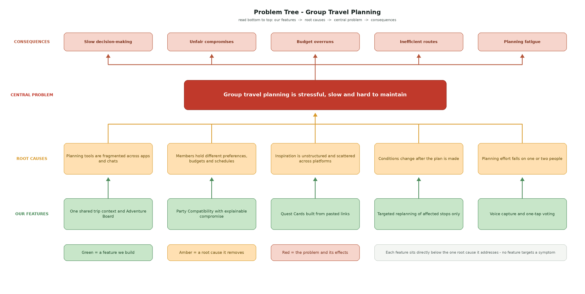

Five root causes feed the central problem: fragmented tools, conflicting preferences, unstructured inspiration, conditions that change after planning, and planning effort that falls on one or two people. The consequences branch upward into slow decisions, unfair compromises, budget overruns, inefficient routes and planning fatigue, and each of our core features is drawn back to the specific root it addresses rather than to the symptom.

#### Primary User Flow

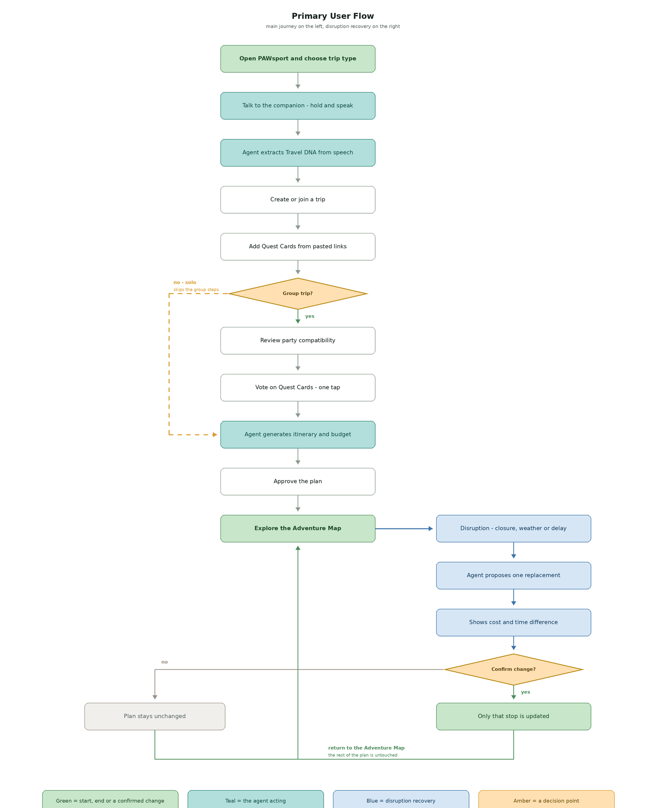

The primary journey runs from opening the app through the solo-or-group decision, spoken consultation with the companion, Travel DNA creation, joining a trip, reviewing party compatibility, adding Quest Cards, voting, itinerary and budget generation, approval, and exploring the adventure map. The recovery path branches at disruption: a closure or weather event triggers a proposed replacement showing the cost and time difference, which the group confirms or rejects without disturbing the rest of the plan.

#### Iteration 2 - Post-Mentor Refinement


Three substantive changes separate this map from the first. Spoken capture appears as a new node connecting the AI companion, the character system and the Gemini audio pipeline — the companion is now the microphone, which makes the character functional rather than decorative. Group handling moved from merging preferences to lowering the cost of contributing, following the observation that only one or two members of any group actually plan. And the map is now split by commitment level, separating the three-week MVP from stretch features, in direct response to the density critique of the first version.

### 2.3 Idea Evolution

     The column says "What changed", not "What we plan to change". -->

| Before feedback | Feedback or learning | What changed | Why it improved the concept |
|---|---|---|---|
| Group planning modelled as merging every member's preferences into one itinerary | Only one or two people in a group actually plan; the rest follow and their suggestions never carry a final say | Party Compatibility was reframed around lowering the effort of contributing rather than arbitrating between equal participants | The real failure in group travel is non-participation, not disagreement. Designing for the silent majority addresses the cause rather than the symptom |
| Budget captured as a single figure supplied by the user | Users do not know their budget as a number — they know a soft ceiling, and naming a maximum is not a commitment to spend it | Budget became a soft range with a flexible ceiling, and the agent treats overspend as a trade-off to surface rather than a rule to enforce | Recommendations now match how people actually hold budgets, so the agent stops rejecting options a user would happily accept |
| Any change to preferences triggered a full re-generation of the itinerary | Re-analysing every member's data whenever one person changes an answer is a hassle and does not scale | Replanning was scoped to the affected activities only, leaving confirmed parts of the plan intact | Mid-trip changes stop being expensive, which is what makes replanning usable rather than theoretical |
| Trip context captured through typed chat and shared links | The app should be designed around catering to lazy people — the less a user must do, the more the app learns | Added spoken capture: the user holds the companion and talks, and the agent extracts structured trip context from unstructured speech | Speaking is lower-effort than typing and preserves qualifying detail — "not too much, but one nice dinner" — that a form discards entirely |
| Single dense mindmap covering every considered feature | The mindmap carries too much stuff and too much process | Produced a second, deliberately narrower mindmap separating the committed MVP from stretch features | The scope a reader sees now matches the scope two people can actually build in three weeks |

### 2.4 Mentor Consultation

We consulted one mentor during the ideation phase. The session focused on how trip information is collected from users and on the real dynamics of group travel.

| Date | Mentor | Feedback received | What we changed |
|---|---|---|---|
| 10 September 2026 | Zach Khong | "Your app should be designed around catering to lazy people." Forms are the wrong capture mechanism — a ten-page form does not get filled in. Ask once in a chat and let the user answer in one message, then extract structure from the unstructured answer | Confirmed our existing chat-sourced approach and committed to it explicitly. Added spoken capture on top of it, so a user can ramble for ninety seconds instead of typing |
| 10 September 2026 | Zach Khong | Travel inspiration arrives as links — an Instagram reel, a TikTok, a Pinterest board — shared into a group chat over time, not entered into an app | The Adventure Board is fed by pasted links rather than manually created cards |
| 10 September 2026 | Zach Khong | "Usually only one or two people are actually doing the planning, and the rest is following." Their suggestions exist but never carry a final say. He asked us to work out why group travel is genuinely hard to coordinate | Party Compatibility was reframed around making contribution effortless for the non-planners rather than mediating between equal participants |
| 10 September 2026 | Zach Khong | Users cannot answer the twenty questions apps ask. On budget: "I know a range. Maybe maximum I want to spend five thousand — but does it mean I have to spend only five thousand? It doesn't really mean that" | Budget became a soft range with a flexible ceiling instead of a fixed figure |
| 10 September 2026 | Zach Khong | If a user changes an answer mid-flow, re-analysing everyone's data again is a hassle | Replanning was scoped to affected activities only |
| 10 September 2026 | Zach Khong | Our mindmap carried "too much stuff" and too much process | Produced a narrower post-mentor mindmap separating committed MVP scope from stretch features |
| 10 September 2026 | Zach Khong | The visual references we showed him already carry usable character and environment assets; we should plan deliberately for how those are sourced or generated | Asset sourcing and licensing were added as an explicit task, documented in section 8 |

He also noted that he had given the same advice about data collection to several other teams, and that the conventional approach is "probably what everyone's gonna do." We treated that as a differentiation signal rather than only a usability note.

Feedback we adopted only in part, and why:

> The suggestion was to do *everything* in one large conversational chat. We adopted the conversational capture but kept structured Quest Cards and group voting rather than moving the entire experience into a chat thread. A pure chat interface makes it harder, not easier, for the quieter members of a group to register an opinion — a single tap on a card is lower-effort than composing a message, and it leaves a visible record of who actually weighed in. Since the mentor's central concern was that non-planners never get a final say, we judged that keeping a tappable surface served that concern better than a chat-only interface would have.

---

## 3. Design and Prototype

### Interactive Prototype

**[Open the interactive PAWsport prototype](FIGMA_PUBLIC_LINK)**

The current prototype follows a three-day Penang group trip. It demonstrates the core PAWsport experience: choosing a trip type, describing the trip through a voice-first AI consultation, reviewing what the companion understood, confirming a Travel DNA profile, exploring the itinerary as an illustrated route, and resolving group-planning conflicts through an explainable AI compromise. The voice capture and AI responses are simulated prototype interactions; backend integrations are planned for the implementation phase.

### Prototype Walkthrough

#### 1. Start the Journey

| Trip entry | AI listening | Transcript review |
|---|---|---|
| 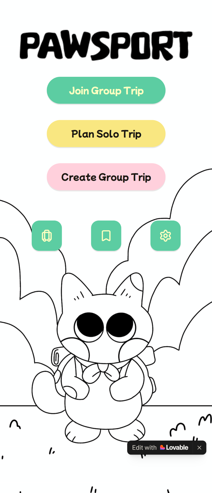 | 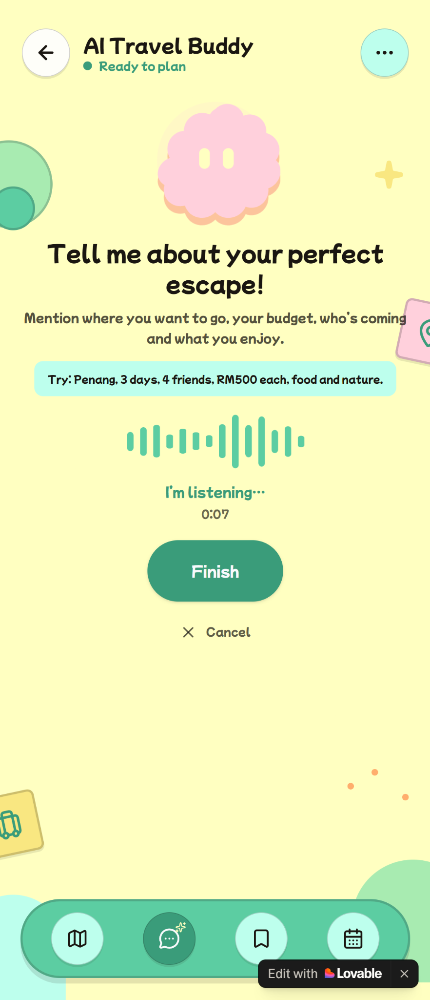 | 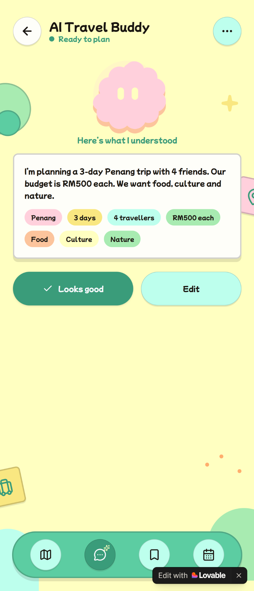 |

The entry screen lets a traveller join an existing group, plan alone or create a new group trip. The AI Travel Buddy then makes voice the primary input: the user can speak naturally about destination, duration, party size, budget and interests, while manual typing remains available. After listening, the companion returns both a readable transcript and structured chips so the user can confirm or edit what it understood before anything is used for planning.

#### 2. Refine the Travel DNA

| Preference follow-up | Travel DNA ready |
|---|---|
| 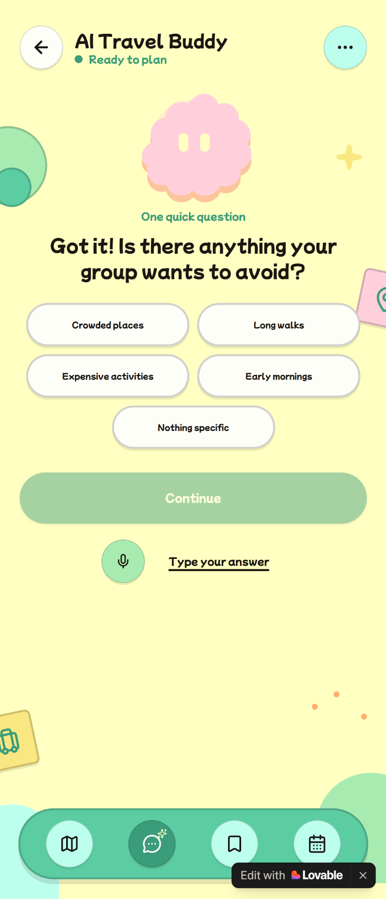 | 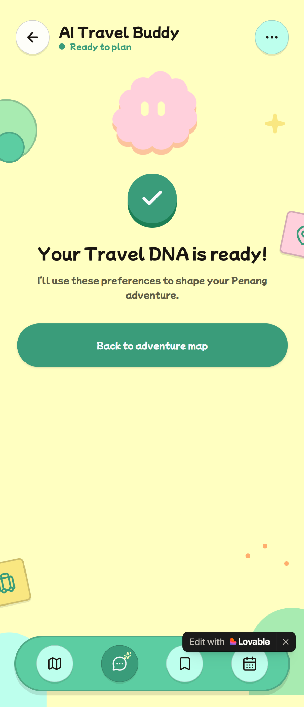 |

Instead of presenting a long questionnaire, the companion asks one focused follow-up about constraints such as crowds, long walks, expensive activities or early mornings. The user can answer with one tap, by voice or by typing. A clear confirmation state then shows that the Travel DNA is ready and will be used to shape the Penang itinerary.

#### 3. Explore the Adventure

| Adventure map | Destination details |
|---|---|
| 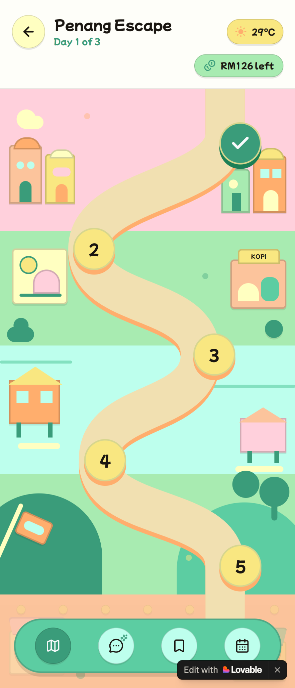 | 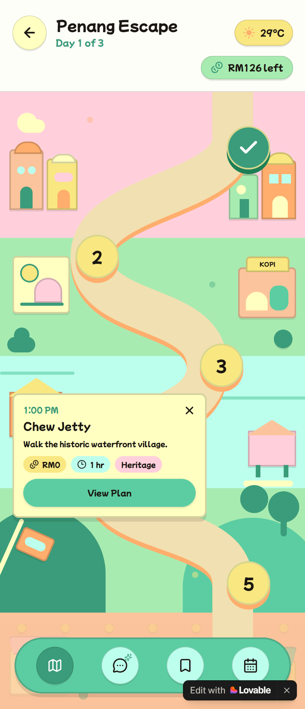 |

The approved itinerary becomes a playful illustrated journey instead of a dense schedule. Numbered nodes communicate progress through the day, while the header keeps weather and remaining budget visible. Tapping a node opens its time, destination, activity, cost, duration and category without cluttering the route; the traveller can then open the full plan when more detail is needed.

#### 4. Balance the Party

| Party lobby | AI compromise |
|---|---|
| 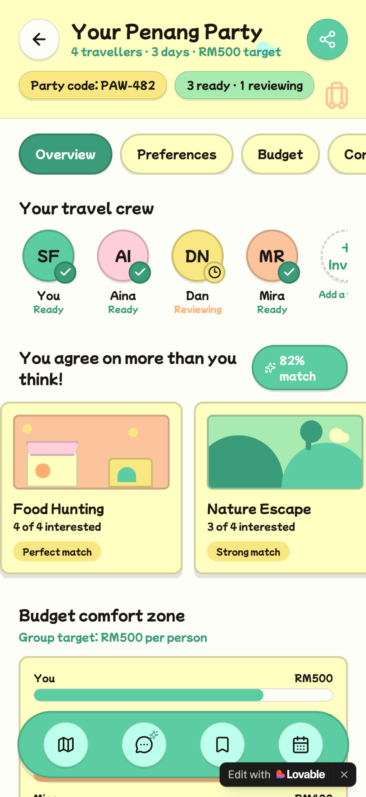 | 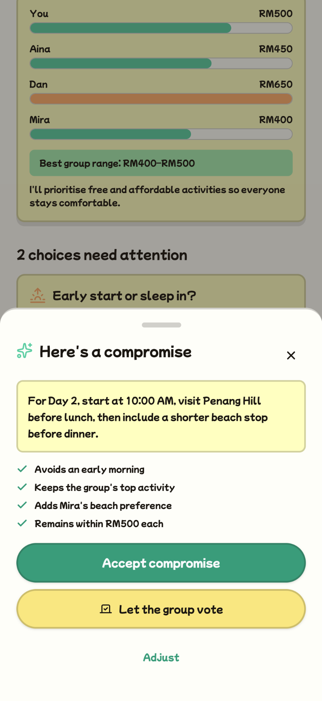 |

The Party Lobby makes group alignment visible at a glance: who is ready, which interests overlap, how individual budgets compare and which choices still need attention. When asked to help, the companion proposes a compromise and explains why it works. Members can accept it, send it to a group vote or adjust it, preserving human control over the final itinerary.

### Design Decisions and Accessibility

- **Adventure-first visual language:** The illustrated route, block-style Penang scenery and level-like destination nodes turn itinerary progress into a journey while keeping time, cost and status understandable.
- **Voice first, not voice only:** The large microphone reduces the effort of explaining a trip, while `Type your answer`, `Edit` and quick-select chips support noisy environments, privacy needs and users who prefer text.
- **A focused AI identity:** The simple animated blob appears on consultation states as a friendly interface cue rather than a decorative mascot competing with the planning content.
- **Progressive disclosure:** Destination details appear only after a node is selected, and the companion asks one follow-up at a time. This keeps the mobile interface readable and avoids overwhelming users with a full form or itinerary.
- **Status is not communicated by colour alone:** Labels such as `Ready`, `Reviewing`, `I'm listening`, vote counts, initials, checkmarks and numbered nodes reinforce every colour-coded state.
- **Human confirmation remains explicit:** Users review the transcript before creating their Travel DNA and can accept, vote on or adjust an AI compromise before it changes the group plan.
- **Mobile-friendly interaction:** Large rounded controls, short labels, fixed navigation and contained cards are designed for comfortable touch use in a narrow mobile viewport.

---

## 4. What Makes It Different

### Our Defining Twist

An AI itinerary generator takes a form and returns a list. PAWsport does something structurally different: it learns a *group* rather than a user, and it learns them from behaviour they already have — talking, and pasting links — rather than from answers they have to compose. That matters because the real failure in group travel is not disagreement, it is non-participation: one or two people plan while everyone else follows, and the followers' preferences never reach the plan because registering them costs more effort than staying quiet. Our agent lowers that cost to a single tap, then mediates rather than decides — it calls structured tools for places, weather, preferences and budget, shows the reasoning and the trade-off behind each compromise, and writes nothing to the itinerary until a member confirms it. The result is a plan that keeps working after it meets reality, because when a closure or a delay breaks one stop, only that stop is reconsidered and the rest of the trip stands.

| Capability | Typical planning experience | PAWsport |
|---|---|---|
| Preference collection | Forms or manual group discussion | Conversational Travel DNA |
| Group coordination | Group-chat messages and manual voting | Compatibility analysis and explainable compromise |
| Inspiration | Saved posts scattered across platforms | Structured Quest Cards on one Adventure Board |
| Itinerary | Static list of activities | Budget-aware illustrated adventure map |
| Disruptions | Group manually searches again | Agent proposes targeted alternatives and explains trade-offs |
| User control | Varies | Confirmation required before itinerary-changing actions |

### Agentic AI Rather Than a Basic Chatbot

The companion is designed to use permitted tools instead of relying only on model memory. A typical workflow is:

1. Read the authenticated trip and group context.
2. Identify missing information or conflicting constraints.
3. Use relevant place, weather, preference and budget tools.
4. Generate a structured recommendation with its reasoning.
5. Ask the user or group to approve the proposed change.
6. Save only the approved itinerary update.

---

## 5. Technical Architecture and Feasibility

### System Architecture

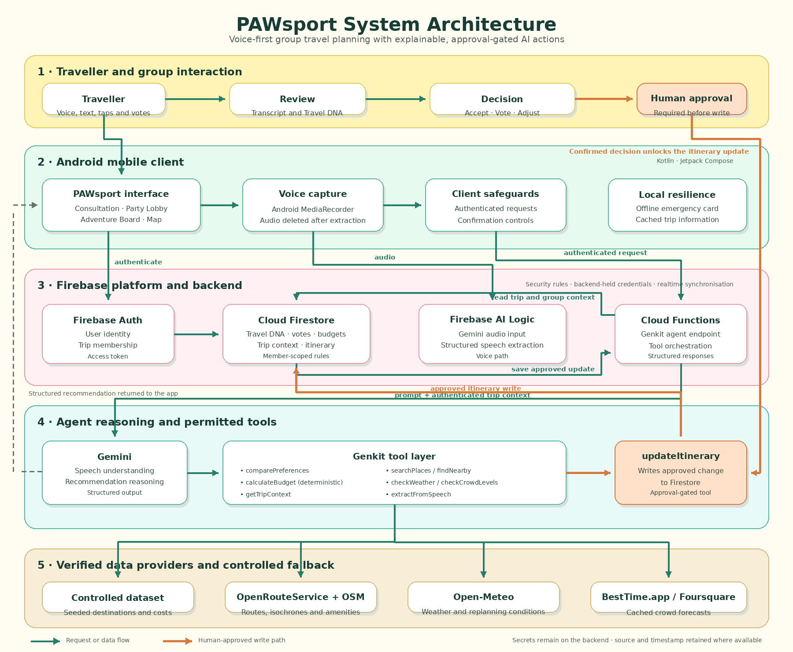

The Kotlin client authenticates through Firebase Authentication and reads or writes permitted trip data in Firestore, then sends authenticated requests to a Genkit endpoint. Genkit loads the trip and group context, Gemini reasons about the request and selects permitted tools, and those tools retrieve place or weather data or calculate budget results deterministically in code. Genkit returns a structured recommendation which the app displays for confirmation, and only an approved change is written back to Firestore and synchronised to the group. Everything in the Mobile App, Firebase and AI Agent zones is planned for the three-week MVP; live place search, crowd data and push notifications are future integrations, and the submitted prototype is a clickable UI rather than a running system.

### Technology Stack

| Layer | Technology | Why selected | Expected constraint |
|---|---|---|---|
| Mobile frontend | Kotlin + Jetpack Compose | Native Android experience and modern UI components | New framework for the team |
| Authentication | Firebase Authentication | Fast identity integration | Configuration and access-rule testing required |
| Database | Cloud Firestore | Realtime group synchronisation and offline-capable mobile data | Correct data model and security rules required |
| Agent backend | Genkit with TypeScript | Tool calling, structured flows and persistent conversations | Additional backend language and deployment |
| AI model | Gemini | Conversation and recommendation reasoning | Quotas, latency and hallucination risk |
| Voice capture | Android `MediaRecorder` → Gemini audio input via Firebase AI Logic | Gemini accepts audio directly, so no separate speech-to-text service is required and the pipeline collapses to a single call | Recording length cap; transcription accuracy varies on Malaysian-accented English and on Malay–English code-switching, which is common in our users' everyday speech |
| Maps, places and amenities | OpenRouteService isochrones with Overpass API over OpenStreetMap data | Free tier with no billing account required. Isochrones answer "what can I reach on foot from here", and Overpass carries the amenity tags the washroom and food finders need — neither requires Google Maps | Rate-limited on the free tier, so amenity results are cached per trip; OSM coverage quality varies across Southeast Asia, so the MVP uses a controlled dataset for one city |
| Crowd levels | BestTime.app foot-traffic forecasts, with Foursquare as fallback | Google's Places API does not officially expose popular times, and the community scraper libraries breach its terms of service | The only commercial dependency in our stack and the only one that can expire mid-demo, since it runs on trial credits. Forecasts are fetched ahead of time and cached with the trip rather than called live during a session |
| Weather | Open-Meteo | Free with no API key at all, which removes both a billing risk and a credential to manage during a demo | Forecast horizon and accuracy degrade beyond roughly a week, so replanning is framed around near-term conditions |
| Hosting/deployment | Cloud Functions for Firebase, alongside the existing Firebase project | Keeps the Genkit service in one console with Auth and Firestore, and avoids a second cloud account | Outbound network calls require the pay-as-you-go Blaze plan even within the free quota, and cold starts add latency to the first agent call |

### Proposed Agent Tools

| Tool | Purpose | Data source/output |
|---|---|---|
| `getTripContext` | Read dates, destination, group and constraints | Firestore trip data |
| `comparePreferences` | Identify agreements and conflicts | Structured preference summary |
| `searchPlaces` | Find suitable activities or destinations | Selected places source or seeded dataset |
| `checkWeather` | Retrieve conditions for replanning | Selected weather provider |
| `calculateBudget` | Validate totals deterministically | Cost breakdown and remaining budget |
| `updateItinerary` | Save an approved change | Firestore write after confirmation |
| `extractFromSpeech` | Turn a spoken note into structured trip context | Gemini audio input, returned against a fixed schema |
| `checkCrowdLevels` | Find the quietest window for a planned stop | Cached BestTime.app foot-traffic forecasts |
| `findNearby` | Locate washrooms, cafés and food within walking distance | OpenRouteService isochrone with Overpass amenity query |

### Safety, Privacy and Reliability

- External service credentials will remain on the backend.
- Firestore access will be restricted to authenticated trip members.
- Budget totals will be validated by deterministic code, not accepted directly from model-generated arithmetic.
- Place and weather recommendations will retain source/timestamp information where available.
- Itinerary-changing actions will require human confirmation.
- The MVP will use a controlled destination dataset if live APIs are unavailable or unreliable.
- Voice input is processed into structured trip data and the audio recording is then deleted. We retain what the agent understood, not the recording itself.
- Members record only themselves, so voice capture never collects a third party without their knowledge. This is the main reason voice notes were chosen over an in-app group call for the MVP.
- Given the lower end of our age range, group invitations are accepted rather than imposed, location is shared only within a trip a member has joined, and no trip data is visible outside its own group.

### Build Plan and Scope

#### Three-Week MVP

- Android navigation and core screens.
- Authentication and traveller profiles.
- Create/join one group trip.
- AI consultation with persistent trip context.
- Group preference comparison.
- Budget-aware itinerary from one controlled destination dataset.
- One weather/closure disruption-replanning scenario.
- User confirmation and Firestore synchronisation.
- Nearby washroom and food finders using OpenRouteService isochrones and Overpass amenity data.
- Crowd-aware scheduling from cached foot-traffic forecasts.
- Offline emergency information from a curated static dataset — embassy address in local script, insurance details and nearest hospital.

#### Stretch Features

- Social-link content extraction from a pasted URL.
- Broader live place search beyond the controlled dataset.
- In-app group call with live transcription.
- More character and map interaction.

#### Explicitly Outside the MVP

- Real flight or hotel purchases.
- Automatic cancellations or spending.
- Unrestricted scraping of social platforms.
- Global destination coverage.
- Full 3D game world.
- Multiple autonomous specialised agents.

### Three-Week Implementation Schedule

| Week | Focus | Planned outcome |
|---|---|---|
| Week 1 | Android and Firebase foundation | Navigation, profiles, authentication and group-trip data |
| Week 2 | Agent and itinerary | Genkit tools, trip context, budget validation and structured itinerary |
| Week 3 | Replanning and demonstration | Group sync, approval flow, disruption scenario, testing and final demo |

---

## 6. Impact and Scalability

### Expected User Impact

- **The planning load stops falling on one person.** Today the organiser reads back through the chat, chases opinions and assembles the plan alone. Contributing costs a tap and a voice note, so the work spreads across the group instead of concentrating on whoever volunteered first.
- **Quiet members actually shape the trip.** The followers in a group hold real preferences but never register them, because speaking up costs more than going along with it. Lowering that cost changes who the plan belongs to.
- **Compromises become visible rather than assumed.** When the agent balances competing preferences it states which constraint it favoured and what it cost, so a group can disagree with the reasoning instead of with each other.
- **Budgets are respected as people actually hold them.** A soft ceiling with room for one deliberate splurge reflects how our users describe their spending, so the plan stops excluding options they would happily have accepted.
- **A broken plan stops meaning starting over.** When weather or a closure affects one stop, the group reviews one proposed replacement with its cost and time difference rather than reopening the whole itinerary mid-trip.

### Scalability Path

1. Begin with Kuala Lumpur and a controlled destination dataset, serving domestic and short-haul regional trips.
2. Expand destination and place coverage through verified integrations.
3. Support additional traveller types such as solo travellers, families and organised groups.
4. Add booking and local-service partnerships only after the core planning workflow is validated.

---

## 7. Team Responsibilities

| Member | Primary responsibility |
|---|---|
| [Fieqah's full name] | Prototype design, character experience, architecture and visual consistency |
| [Aida's full name] | Research, ideation documentation, README, slides and submission assembly |

Both members contributed to the initial ideation, mentor consultation, scope decisions and final presentation.

---

## 8. Project Assets and Credits

- Character/illustration assets: [Creator, asset pack and licence]
- Icons: [Source and licence]
- Map/environment assets: [Source and licence]
- Fonts: [Source and licence]
- Other libraries/resources: [Source and licence]

Full details: [Asset credits](docs/assets/CREDITS.md)

---

## Repository Structure

```text
project-root/
├── README.md
├── docs/
│   ├── ideation/
│   │   ├── mindmap-v1-pre-mentor.png
│   │   ├── mindmap-v2-post-mentor.png
│   │   ├── problem-tree.png
│   │   └── user-flow.png
│   ├── prototype/
│   │   ├── screen-01-trip-entry.png
│   │   ├── screen-02-ai-listening.png
│   │   ├── screen-03-ai-transcript-review.png
│   │   ├── screen-04-ai-follow-up.png
│   │   ├── screen-05-travel-dna-ready.png
│   │   ├── screen-06-adventure-map.png
│   │   ├── screen-07-destination-details.png
│   │   ├── screen-08-party-lobby.png
│   │   └── screen-09-ai-compromise.png
│   ├── architecture/
│   │   └── system-architecture.png
│   ├── research/
│   │   ├── competitor-comparison.md
│   │   └── user-feedback.md
│   └── assets/
│       └── CREDITS.md
├── presentation/
│   └── slides.pdf
└── [android-app and backend folders added during the building phase]
```
